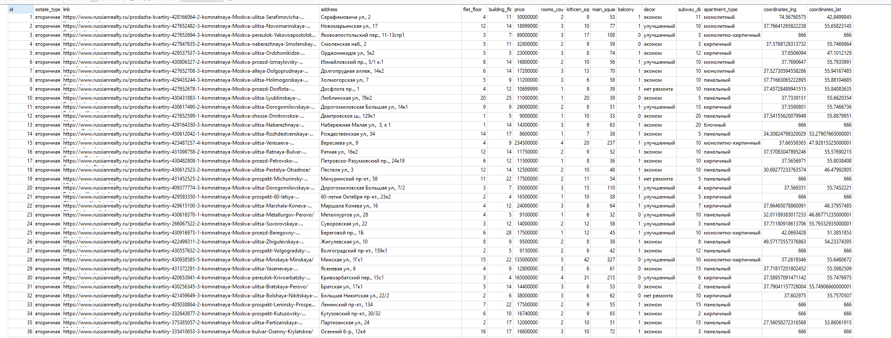

# Задание 4: Анализ геоданных для регрессионного анализа цен

## Описание задания
На основе открытых датасетов геоданных с использованием библиотек `osmnx` и `folium` необходимо сформировать актуальные выборки функциональных данных для проведения регрессионного анализа их цены.

## Используемые технологии
- **osmnx**: Библиотека для работы с геоданными OpenStreetMap
- **folium**: Библиотека для визуализации геоданных на интерактивных картах

## Цель работы
1. Сбор и обработка геоданных из открытых источников
2. Формирование структурированных выборок данных
3. Подготовка данных для регрессионного анализа цен

## Ожидаемые результаты
- Структурированный набор геоданных
- Подготовленные выборки для регрессионного анализа

